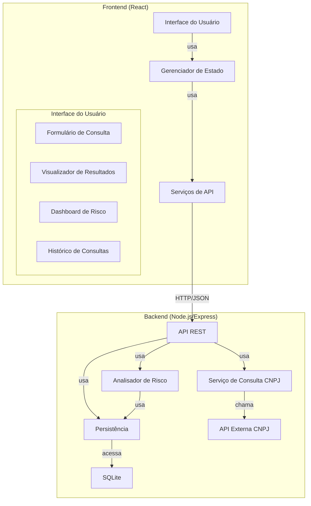

# Documento de Arquitetura - Analisador de Risco de Cliente PJ via CNPJ

## 1. Visão Geral da Arquitetura

O sistema "Analisador de Risco de Cliente PJ via CNPJ" será desenvolvido seguindo uma arquitetura cliente-servidor moderna, com separação clara entre frontend e backend, seguindo princípios de design RESTful. A arquitetura adotada é uma aplicação web de três camadas (apresentação, aplicação e dados), com componentes desacoplados que facilitam a manutenção e evolução do sistema.

### Abordagem Arquitetural

Para este sistema, adotaremos uma arquitetura baseada em componentes com os seguintes princípios:

1. **Separação de Responsabilidades**: Frontend e backend claramente separados com interfaces bem definidas
2. **Design Orientado a API**: Backend expondo serviços RESTful para o frontend consumir
3. **Stateless**: O servidor não mantém estado da sessão do cliente, facilitando a escalabilidade
4. **Desacoplamento**: Componentes com baixo acoplamento para facilitar manutenção e testes
5. **Segurança por Design**: Considerações de segurança incorporadas desde o início

### Justificativa

Esta abordagem arquitetural foi escolhida pelos seguintes motivos:

- **Simplicidade**: Adequada para o escopo do sistema sem adicionar complexidade desnecessária
- **Manutenibilidade**: Facilita atualizações e evolução do sistema
- **Escalabilidade**: Permite escalar componentes independentemente conforme necessário
- **Rápido Desenvolvimento**: Possibilita desenvolvimento paralelo do frontend e backend
- **Compatibilidade**: Alinhada com as tecnologias especificadas (Node.js, React/HTML5+JS, SQLite)
- **Responsividade**: Facilita a implementação de uma interface responsiva para diferentes dispositivos

## 2. Escolha de Tecnologias

### Frontend
- **Framework**: React.js 18.x
  - **Justificativa**: Oferece componentização, reatividade, grande ecossistema de bibliotecas e performance superior
  - **Bibliotecas Complementares**:
    - **Axios**: Para requisições HTTP ao backend
    - **React Router**: Para navegação entre telas
    - **React-Bootstrap**: Para componentes de UI responsivos
    - **Chart.js**: Para visualização gráfica dos resultados
    - **Formik**: Para gerenciamento de formulários
    - **Yup**: Para validação de entradas

### Backend
- **Plataforma**: Node.js 18.x LTS
  - **Justificativa**: Eficiente para operações I/O, mesmo runtime que o frontend (JavaScript), grande ecossistema
  - **Framework**: Express.js 4.x
    - **Justificativa**: Maduro, bem documentado, minimalista e extensível
  - **Bibliotecas Complementares**:
    - **Axios**: Para chamadas à API externa de CNPJ
    - **CORS**: Para gerenciamento de Cross-Origin Resource Sharing
    - **Helmet**: Para adicionar headers de segurança
    - **Winston**: Para logging estruturado
    - **Joi**: Para validação de dados
    - **node-cache**: Para cache de resultados de consultas

### Banco de Dados
- **SQLite 3.x**
  - **Justificativa**: Sem necessidade de instalação separada, embutido na aplicação, adequado para o volume de dados esperado, baixa complexidade de manutenção
  - **ORM**: Sequelize
    - **Justificativa**: Facilita operações CRUD, migrações, e oferece flexibilidade para migração para outros SGBDs no futuro

### Ferramentas de Desenvolvimento
- **ESLint**: Para garantir padrões de código
- **Prettier**: Para formatação consistente
- **Jest**: Para testes unitários
- **Supertest**: Para testes de API

### Justificativa das Escolhas

As tecnologias escolhidas atendem aos requisitos não funcionais identificados:

- **Desempenho**: React e Node.js são conhecidos por sua eficiência e baixa latência
- **Manutenibilidade**: Tecnologias maduras, bem documentadas e com ampla comunidade
- **Usabilidade**: React facilita a criação de interfaces responsivas e intuitivas
- **Escalabilidade**: Arquitetura permite escalar horizontalmente quando necessário
- **Segurança**: Bibliotecas específicas para reforçar a segurança da aplicação

## 3. Componentes do Sistema

### 3.1 Componentes do Frontend

#### Componente: Interface do Usuário (UI)
- **Responsabilidade**: Apresentar a interface gráfica ao usuário e capturar interações
- **Subcomponentes**:
  - **Formulário de Consulta**: Para entrada do CNPJ
  - **Visualizador de Resultados**: Para exibição dos dados e análise
  - **Dashboard de Risco**: Para apresentação visual do score e sinais de alerta
  - **Histórico de Consultas**: Para acesso a consultas anteriores da sessão

#### Componente: Gerenciador de Estado
- **Responsabilidade**: Gerenciar o estado da aplicação no frontend
- **Implementação**: Context API do React
- **Subcomponentes**:
  - **Estado de Consulta**: Gerencia o estado da consulta atual
  - **Estado de Histórico**: Gerencia o histórico de consultas da sessão

#### Componente: Serviços de API
- **Responsabilidade**: Comunicação com o backend
- **Implementação**: Axios para chamadas HTTP
- **Subcomponentes**:
  - **Serviço de Consulta CNPJ**: Envia requisições de consulta ao backend
  - **Serviço de Histórico**: Gerencia o histórico localmente

### 3.2 Componentes do Backend

#### Componente: API REST
- **Responsabilidade**: Expor endpoints para o frontend
- **Implementação**: Express.js
- **Subcomponentes**:
  - **Rotas de Consulta**: Endpoints para consulta de CNPJ
  - **Middleware de Validação**: Validação de entradas
  - **Middleware de Segurança**: Implementação de medidas de segurança

#### Componente: Serviço de Consulta
- **Responsabilidade**: Realizar consultas à API externa de CNPJ
- **Implementação**: Axios + sistema de cache
- **Subcomponentes**:
  - **Cliente HTTP**: Para chamadas à API externa
  - **Cache**: Para armazenar resultados temporariamente

#### Componente: Analisador de Risco
- **Responsabilidade**: Calcular o score de risco baseado nos dados do CNPJ
- **Implementação**: Lógica de negócio em JavaScript
- **Subcomponentes**:
  - **Motor de Regras**: Aplica os critérios de pontuação
  - **Classificador**: Determina o nível de risco com base no score

#### Componente: Persistência de Dados
- **Responsabilidade**: Gerenciar o acesso ao banco de dados
- **Implementação**: Sequelize ORM
- **Subcomponentes**:
  - **Modelos**: Representação das entidades no banco
  - **Repositórios**: Lógica de acesso aos dados

### 3.3 Relacionamento entre Componentes

Os componentes interagem conforme o diagrama a seguir:


## 4. Integrações

### Integração com API Pública de Consulta CNPJ

#### Detalhes da API
- **URL Base**: https://publica.cnpj.ws/cnpj
- **Método**: GET
- **Endpoint**: `/{cnpj}` (CNPJ sem formatação)
- **Formato de Resposta**: JSON
- **Documentação**: https://docs.cnpj.ws/referencia-de-api/api-publica/consultando-cnpj

#### Fluxo de Dados
1. O backend recebe o CNPJ do frontend
2. O backend valida o formato do CNPJ
3. O backend verifica se o resultado já está em cache
4. Se não estiver em cache, faz a requisição à API externa
5. Processa os dados recebidos e extrai as informações relevantes
6. Armazena em cache para futuras consultas
7. Retorna os dados para o frontend

#### Tratamento de Falhas
- **Timeout**: Configuração de timeout de 5 segundos para a API
- **Retry**: Implementação de política de retry (até 3 tentativas com backoff exponencial)
- **Fallback**: Mensagem amigável ao usuário em caso de falha persistente
- **Cache**: Resultados em cache reduzem dependência da disponibilidade da API
- **Validação**: Validação dos dados recebidos para garantir integridade

#### Modelo de Requisição e Resposta

**Requisição**:
```
GET https://publica.cnpj.ws/cnpj/12345678000199
```

**Resposta (Simplificada)**:
```json
{
  "razao_social": "EMPRESA EXEMPLO LTDA",
  "nome_fantasia": "EXEMPLO",
  "cnpj": "12345678000199",
  "natureza_juridica": {
    "codigo": "2062",
    "descricao": "Sociedade Empresária Limitada"
  },
  "porte": {
    "codigo": "3",
    "descricao": "EMPRESA DE PEQUENO PORTE"
  },
  "situacao_cadastral": {
    "codigo": "2",
    "data": "2020-01-01",
    "motivo": null,
    "descricao": "ATIVA"
  },
  "data_inicio_atividade": "2015-01-01",
  "cnae_principal": {
    "codigo": "6201500",
    "descricao": "Desenvolvimento de programas de computador sob encomenda"
  },
  "endereco": {
    "tipo_logradouro": "AVENIDA",
    "logradouro": "EXEMPLO",
    "numero": "123",
    "complemento": "SALA 1",
    "bairro": "CENTRO",
    "cep": "12345678",
    "uf": "SP",
    "municipio": "SÃO PAULO"
  }
}
```

## 5. Modelo de Dados

### 5.1 Modelo Conceitual

O sistema utilizará as seguintes entidades principais:

1. **Consulta**: Representa uma consulta de CNPJ realizada
2. **Empresa**: Dados da empresa consultada
3. **Análise**: Resultado da análise de risco

### 5.2 Modelo Lógico


### 5.3 Esquema do Banco de Dados SQLite

```sql
-- Tabela para armazenar informações de consultas
CREATE TABLE consultas (
    id INTEGER PRIMARY KEY AUTOINCREMENT,
    cnpj TEXT NOT NULL,
    data_consulta DATETIME DEFAULT CURRENT_TIMESTAMP,
    ip_origem TEXT,
    user_agent TEXT
);

-- Tabela para armazenar informações das empresas consultadas
CREATE TABLE empresas (
    id INTEGER PRIMARY KEY AUTOINCREMENT,
    cnpj TEXT UNIQUE NOT NULL,
    razao_social TEXT,
    nome_fantasia TEXT,
    situacao_cadastral TEXT,
    data_abertura DATE,
    cnae_codigo TEXT,
    cnae_descricao TEXT,
    porte TEXT,
    endereco_completo TEXT,
    data_atualizacao DATETIME DEFAULT CURRENT_TIMESTAMP
);

-- Tabela para armazenar resultados de análises
CREATE TABLE analises (
    id INTEGER PRIMARY KEY AUTOINCREMENT,
    consulta_id INTEGER NOT NULL,
    score_final INTEGER NOT NULL,
    classificacao_risco TEXT NOT NULL,
    criterios_aplicados TEXT, -- JSON serializado
    sinais_alerta TEXT, -- JSON serializado
    data_analise DATETIME DEFAULT CURRENT_TIMESTAMP,
    FOREIGN KEY (consulta_id) REFERENCES consultas(id)
);

-- Índices para otimização
CREATE INDEX idx_consultas_cnpj ON consultas(cnpj);
CREATE INDEX idx_empresas_cnpj ON empresas(cnpj);
CREATE INDEX idx_analises_consulta ON analises(consulta_id);
```

### 5.4 Estratégias de Armazenamento e Recuperação

- **Cache**: Resultados de consultas recentes serão mantidos em cache em memória para acesso rápido
- **Persistência**: Dados de consultas serão armazenados no SQLite para análises futuras e estatísticas
- **Serialização**: Estruturas complexas como critérios aplicados serão serializadas como JSON
- **Índices**: Índices criados para otimizar consultas frequentes
- **Limpeza**: Implementação de rotina para limpar dados antigos (manter apenas os últimos 90 dias)

## 6. Infraestrutura

### 6.1 Requisitos de Infraestrutura

#### Hardware Recomendado
- **CPU**: 2+ cores
- **Memória**: 2GB+ RAM
- **Armazenamento**: 1GB+ espaço livre

#### Software Necessário
- **Sistema Operacional**: Linux, Windows ou macOS
- **Runtime**: Node.js 18.x LTS
- **Bibliotecas do Sistema**: Dependências para compilação de pacotes nativos do Node.js
- **Navegadores Suportados**: Chrome, Firefox, Safari, Edge (duas últimas versões)

### 6.2 Ambientes

#### Ambiente de Desenvolvimento
- **Configuração**: Instâncias locais de todos os componentes
- **Ferramentas**: VS Code com plugins recomendados, ESLint, Prettier
- **Banco de Dados**: SQLite local
- **Proxy Reverso**: Não necessário

#### Ambiente de Teste/Homologação
- **Configuração**: Similar ao ambiente de produção, mas com recursos reduzidos
- **Isolamento**: Ambiente isolado para testes sem interferir na produção
- **Monitoramento**: Básico para validação de performance

#### Ambiente de Produção
- **Configuração**: Otimizada para desempenho e disponibilidade
- **Segurança**: Configurações mais restritivas
- **Monitoramento**: Completo para todas as métricas críticas
- **Backup**: Rotina automática de backup do banco de dados

### 6.3 Implantação

- **Containerização**: Docker para empacotar a aplicação e suas dependências
- **Configuração**: Variáveis de ambiente para configurações específicas do ambiente
- **Inicialização**: Scripts para automação da configuração inicial
- **Atualização**: Processo de deploy sem downtime quando possível

## 7. Segurança

### 7.1 Proteção de Dados

- **Em Trânsito**: Toda comunicação via HTTPS
- **Em Repouso**: Sem armazenamento de dados sensíveis
- **Logs**: Sanitização de dados sensíveis nos logs
- **Temporalidade**: Política de retenção de dados (90 dias)

### 7.2 Medidas de Segurança

- **Input Validation**: Validação rigorosa de todas as entradas
- **Rate Limiting**: Limite de requisições por IP para prevenir abusos
- **Headers de Segurança**: Implementação via Helmet.js:
  - Content-Security-Policy
  - X-XSS-Protection
  - X-Content-Type-Options
  - Referrer-Policy
  - X-Frame-Options
- **CORS**: Configuração adequada para permitir apenas origens confiáveis
- **Dependências**: Verificação regular de vulnerabilidades em dependências

### 7.3 Gestão de Credenciais

- **API Keys**: Armazenadas como variáveis de ambiente, nunca no código-fonte
- **Rotação**: Rotação periódica de credenciais quando aplicável
- **Princípio do Menor Privilégio**: Uso apenas das permissões necessárias

## 8. Diagramas

### 8.1 Diagrama de Componentes



### 8.2 Diagrama de Fluxo de Dados


### 8.3 Diagrama de Sequência - Consulta CNPJ


### 8.4 Diagrama de Implantação


## 9. Considerações sobre Qualidade

### 9.1 Desempenho
- **Caching**: Implementação de cache para consultas frequentes
- **Otimização de Consultas**: Índices adequados no banco de dados
- **Carregamento Assíncrono**: Carregamento otimizado de recursos no frontend
- **Bundling e Minificação**: Redução do tamanho dos assets para carregamento mais rápido
- **Lazy Loading**: Carregamento sob demanda de componentes menos utilizados

### 9.2 Escalabilidade
- **Arquitetura Stateless**: Facilita escalar horizontalmente
- **Cache Distribuído**: Possibilidade de implementar em fases futuras
- **Separação de Responsabilidades**: Permite escalar componentes independentemente

### 9.3 Manutenibilidade
- **Organização Modular**: Código organizado em módulos coesos
- **Padrões de Código**: ESLint e Prettier para garantir consistência
- **Documentação**: Código documentado adequadamente
- **Testes Automatizados**: Cobertura adequada de testes

### 9.4 Potenciais Gargalos e Mitigações

| Gargalo Potencial | Estratégia de Mitigação |
|-------------------|-------------------------|
| Limite de requisições da API CNPJ | Implementação de cache e política de retry com backoff exponencial |
| Crescimento do banco de dados | Implementação de política de retenção de dados |
| Concorrência de requisições | Configuração adequada de pool de conexões |
| Latência de rede com API externa | Timeout configurável e fallback para últimos dados disponíveis |
| Ataques de negação de serviço | Rate limiting por IP e proteções no nível da aplicação |

## 10. Estratégia de Implementação

### 10.1 Abordagem de Implementação

Recomendamos uma abordagem incremental baseada em MVPs (Minimum Viable Products), com as seguintes fases:

1. **MVP 1 - Core Functionality**:
   - Consulta básica de CNPJ
   - Cálculo simplificado de score
   - Interface básica

2. **MVP 2 - Enhanced Features**:
   - Dashboard completo com visualizações
   - Detalhamento dos critérios
   - Sinais de alerta visuais

3. **MVP 3 - Additional Features**:
   - Histórico de consultas
   - Melhorias de UX/UI
   - Otimizações de performance

### 10.2 Componentes para Desenvolvimento Paralelo

Os seguintes componentes podem ser desenvolvidos em paralelo:

- **Frontend**: Interface do usuário e componentes visuais
- **Backend - API**: Estrutura básica da API e validações
- **Backend - Serviço de Consulta**: Integração com API externa
- **Backend - Analisador de Risco**: Lógica de cálculo de score
- **Banco de Dados**: Estrutura inicial e migrações

### 10.3 Sequência Lógica de Desenvolvimento

1. **Fase Inicial**:
   - Configuração do ambiente de desenvolvimento
   - Estruturação do projeto (frontend e backend)
   - Implementação da estrutura do banco de dados

2. **Fase de Integração**:
   - Implementação do serviço de consulta à API de CNPJ
   - Implementação da lógica de cálculo de score
   - Desenvolvimento da API REST

3. **Fase de Interface**:
   - Desenvolvimento dos componentes de UI
   - Integração do frontend com o backend
   - Implementação do dashboard de resultados

4. **Fase de Finalização**:
   - Implementação de cache e otimizações
   - Testes e correções
   - Documentação final e preparação para deploy

## 11. Conclusão

A arquitetura proposta para o "Analisador de Risco de Cliente PJ via CNPJ" foi desenhada para atender todos os requisitos funcionais e não funcionais especificados, enquanto mantém um equilíbrio entre simplicidade e robustez. A solução é:

- **Funcionalmente Completa**: Implementa todas as funcionalidades solicitadas
- **Tecnicamente Viável**: Utiliza tecnologias maduras e bem estabelecidas
- **Manutenível**: Estruturada para facilitar manutenção e evolução
- **Escalável**: Preparada para crescer conforme necessário
- **Segura**: Incorpora práticas de segurança desde o design inicial

A implementação conforme esta arquitetura resultará em um sistema totalmente funcional (não apenas um mockup) que atenderá as necessidades dos usuários finais e poderá evoluir com requisitos futuros.

---

## Apêndice A: Glossário

- **API**: Application Programming Interface
- **REST**: Representational State Transfer
- **CNPJ**: Cadastro Nacional da Pessoa Jurídica
- **CNAE**: Classificação Nacional de Atividades Econômicas
- **ORM**: Object-Relational Mapping
- **CORS**: Cross-Origin Resource Sharing
- **MVP**: Minimum Viable Product
- **HTTPS**: Hypertext Transfer Protocol Secure
- **JWT**: JSON Web Token
- **SQL**: Structured Query Language