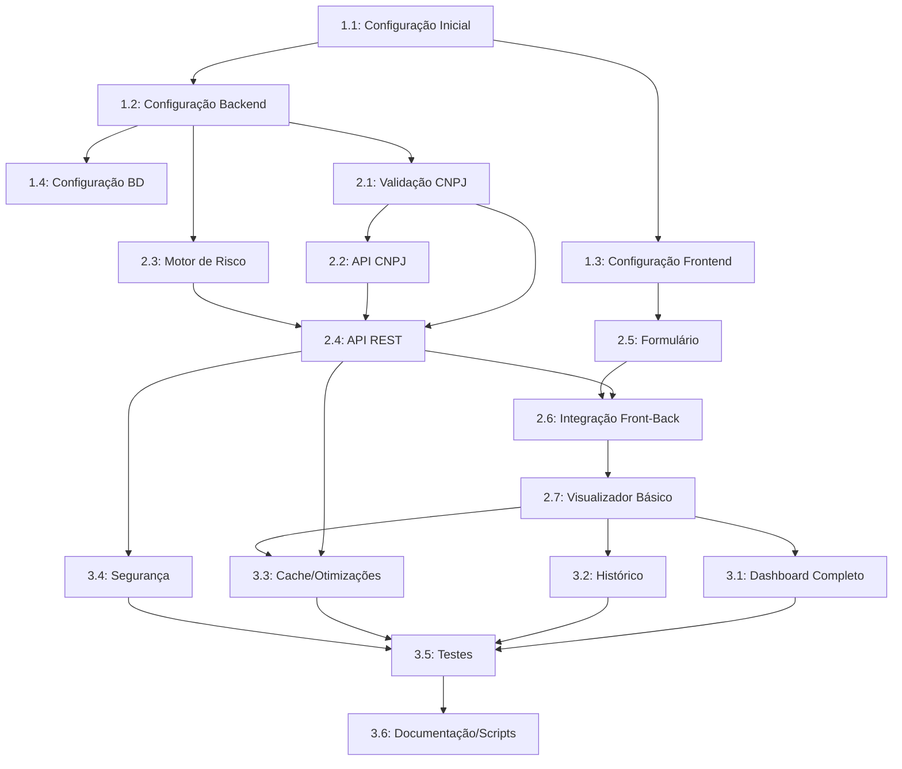

# Backlog de Desenvolvimento - Analisador de Risco de Cliente PJ via CNPJ

## Introdução

Este documento detalha o planejamento de desenvolvimento para o sistema "Analisador de Risco de Cliente PJ via CNPJ". As tarefas foram decompostas a partir das User Stories definidas pelo Product Manager e seguem a arquitetura proposta pelo Solution Architect. O objetivo é fornecer um roteiro claro e detalhado para implementação do sistema, garantindo que seja totalmente funcional e atenda a todos os requisitos especificados.

## 1. Visão Geral do Desenvolvimento

O desenvolvimento será organizado em três fases principais, conforme sugerido na estratégia de implementação da arquitetura:

1. **Fase 1 - Infraestrutura e Fundação (Sprint 1)**
   - Configuração do ambiente
   - Estrutura básica do projeto
   - Implementação do banco de dados

2. **Fase 2 - Funcionalidades Essenciais (Sprint 2)**
   - Consulta de CNPJ e integração com API externa
   - Lógica de cálculo de risco
   - Interface básica de usuário

3. **Fase 3 - Funcionalidades Avançadas e Refinamentos (Sprint 3)**
   - Dashboard completo
   - Histórico de consultas
   - Otimizações e melhorias finais

## 2. Detalhamento das Tarefas

### 2.1. Fase 1: Infraestrutura e Fundação

#### Tarefa 1.1: Configuração Inicial do Projeto

**Descrição:**  
Configurar a estrutura básica do projeto, incluindo configuração do ambiente de desenvolvimento, repositório Git, e estrutura de diretórios.

**Detalhes Técnicos:**
- Inicializar repositório Git
- Configurar estrutura de pastas (frontend e backend)
- Configurar ferramentas de qualidade de código (ESLint, Prettier)
- Configurar ambiente de desenvolvimento

**Entregáveis:**
- Estrutura de diretórios do projeto
- Configurações iniciais (package.json, .gitignore, etc)
- Documentação de setup do ambiente

**Pré-requisitos:**
- Acesso às especificações técnicas

**Dependências:**
- Nenhuma

**Critérios de Aceitação:**
- Projeto inicializado e estruturado
- Ferramentas de qualidade configuradas
- Ambientes de desenvolvimento prontos para uso

**Estimativa:**
- **Esforço:** 4 horas
- **Recursos:** 1 desenvolvedor full-stack sênior
- **Prioridade:** Alta

---

#### Tarefa 1.2: Configuração do Backend

**Descrição:**  
Configurar o projeto Node.js com Express e instalar as dependências necessárias.

**Detalhes Técnicos:**
- Inicializar projeto Node.js
- Instalar e configurar Express.js
- Configurar middleware essenciais (CORS, Helmet, etc)
- Configurar estrutura de arquivos do backend
- Implementar sistema básico de logging

**Entregáveis:**
- Estrutura do projeto backend
- Servidor Express básico funcional
- Middleware configurados

**Pré-requisitos:**
- Tarefa 1.1 concluída

**Dependências:**
- Nenhuma

**Critérios de Aceitação:**
- Servidor inicia sem erros
- Middleware básicos configurados
- Estrutura de arquivos segue padrões de organização

**Estimativa:**
- **Esforço:** 4 horas
- **Recursos:** 1 desenvolvedor backend pleno
- **Prioridade:** Alta

---

#### Tarefa 1.3: Configuração do Frontend

**Descrição:**  
Configurar o projeto React e instalar as dependências necessárias.

**Detalhes Técnicos:**
- Criar aplicação React usando Create React App ou Vite
- Instalar e configurar bibliotecas necessárias (Axios, React Router, etc)
- Configurar estrutura de arquivos do frontend
- Implementar tema e componentes básicos de UI

**Entregáveis:**
- Estrutura do projeto frontend
- Aplicação React básica funcional
- Componentes de UI básicos

**Pré-requisitos:**
- Tarefa 1.1 concluída

**Dependências:**
- Nenhuma

**Critérios de Aceitação:**
- Aplicação inicia sem erros
- Estrutura de arquivos organizada
- Tema básico implementado

**Estimativa:**
- **Esforço:** 6 horas
- **Recursos:** 1 desenvolvedor frontend pleno
- **Prioridade:** Alta

---

#### Tarefa 1.4: Configuração do Banco de Dados

**Descrição:**  
Configurar o banco de dados SQLite e implementar o ORM Sequelize.

**Detalhes Técnicos:**
- Instalar e configurar SQLite
- Configurar Sequelize ORM
- Implementar modelos de dados conforme o esquema definido
- Criar scripts de migração para criar as tabelas

**Entregáveis:**
- Configuração do banco de dados
- Modelos implementados
- Scripts de migração

**Pré-requisitos:**
- Tarefa 1.2 concluída

**Dependências:**
- Nenhuma

**Critérios de Aceitação:**
- Banco de dados configurado corretamente
- Modelos refletem o esquema de dados definido
- Migrações executam sem erros

**Estimativa:**
- **Esforço:** 5 horas
- **Recursos:** 1 desenvolvedor backend pleno
- **Prioridade:** Alta

---

### 2.2. Fase 2: Funcionalidades Essenciais

#### Tarefa 2.1: Implementação da Validação de CNPJ

**Descrição:**  
Implementar a validação de formato e dígitos verificadores de CNPJ.

**Detalhes Técnicos:**
- Desenvolver função de validação de formato de CNPJ
- Implementar cálculo de dígitos verificadores
- Criar helper para formatação e sanitização de CNPJ

**Entregáveis:**
- Módulo de validação de CNPJ
- Testes unitários para a validação

**Pré-requisitos:**
- Tarefa 1.2 concluída

**Dependências:**
- Nenhuma

**Critérios de Aceitação:**
- Função valida corretamente CNPJs válidos e inválidos
- Testes unitários passam para diversos cenários
- Código documentado e seguindo padrões

**Estimativa:**
- **Esforço:** 3 horas
- **Recursos:** 1 desenvolvedor backend júnior
- **Prioridade:** Alta

---

#### Tarefa 2.2: Integração com API Externa de CNPJ

**Descrição:**  
Implementar o serviço de consulta à API pública de CNPJ com tratamento de erros e cache.

**Detalhes Técnicos:**
- Desenvolver cliente HTTP para a API de CNPJ
- Implementar sistema de cache para resultados
- Configurar retry e fallback para falhas
- Implementar mapeamento de dados da resposta

**Entregáveis:**
- Serviço de consulta CNPJ
- Sistema de cache implementado
- Tratamento de erros e retries

**Pré-requisitos:**
- Tarefa 1.2 concluída
- Tarefa 2.1 concluída

**Dependências:**
- Disponibilidade da API externa

**Critérios de Aceitação:**
- Serviço consulta e retorna dados corretamente
- Cache funciona conforme esperado
- Sistema lida adequadamente com falhas da API
- Testes automatizados validam o comportamento

**Estimativa:**
- **Esforço:** 8 horas
- **Recursos:** 1 desenvolvedor backend pleno
- **Prioridade:** Alta

---

#### Tarefa 2.3: Implementação do Motor de Cálculo de Risco

**Descrição:**  
Desenvolver a lógica para calcular o score de risco com base nos critérios definidos.

**Detalhes Técnicos:**
- Implementar algoritmo de cálculo de score
- Desenvolver lógica para identificação de sinais de alerta
- Criar regras para classificação de risco

**Entregáveis:**
- Módulo de cálculo de risco
- Testes unitários para validação

**Pré-requisitos:**
- Tarefa 1.2 concluída

**Dependências:**
- Nenhuma

**Critérios de Aceitação:**
- Cálculo aplica corretamente todos os critérios
- Classificação de risco é determinada corretamente
- Sinais de alerta são identificados conforme esperado
- Testes unitários validam diversos cenários

**Estimativa:**
- **Esforço:** 6 horas
- **Recursos:** 1 desenvolvedor backend sênior
- **Prioridade:** Alta

---

#### Tarefa 2.4: Implementação da API REST

**Descrição:**  
Desenvolver os endpoints da API REST para consulta e análise de CNPJ.

**Detalhes Técnicos:**
- Implementar endpoint para análise de CNPJ
- Configurar validações de entrada
- Implementar tratamento de erros
- Documentar a API

**Entregáveis:**
- Endpoints da API implementados
- Documentação da API
- Testes de integração

**Pré-requisitos:**
- Tarefa 1.2 concluída
- Tarefa 2.1 concluída
- Tarefa 2.2 concluída
- Tarefa 2.3 concluída

**Dependências:**
- Nenhuma

**Critérios de Aceitação:**
- Endpoints respondem corretamente
- Validações funcionam conforme esperado
- Erros são tratados adequadamente
- Documentação clara e completa

**Estimativa:**
- **Esforço:** 5 horas
- **Recursos:** 1 desenvolvedor backend pleno
- **Prioridade:** Alta

---

#### Tarefa 2.5: Implementação do Formulário de Consulta

**Descrição:**  
Desenvolver o componente de formulário para entrada do CNPJ.

**Detalhes Técnicos:**
- Criar componente de formulário React
- Implementar validação de entrada
- Adicionar feedback visual
- Implementar máscara de CNPJ

**Entregáveis:**
- Componente de formulário
- Validações de frontend
- Feedback visual para o usuário

**Pré-requisitos:**
- Tarefa 1.3 concluída

**Dependências:**
- Nenhuma

**Critérios de Aceitação:**
- Formulário aceita entrada de CNPJ
- Validação funciona corretamente
- Feedback visual é claro para o usuário
- Máscara de CNPJ funciona adequadamente

**Estimativa:**
- **Esforço:** 4 horas
- **Recursos:** 1 desenvolvedor frontend júnior
- **Prioridade:** Alta

---

#### Tarefa 2.6: Integração Frontend-Backend

**Descrição:**  
Implementar a comunicação entre o frontend e o backend para consulta de CNPJ.

**Detalhes Técnicos:**
- Criar serviço de API no frontend usando Axios
- Implementar chamadas para o endpoint de análise
- Configurar tratamento de erros
- Implementar indicador de carregamento

**Entregáveis:**
- Serviço de API no frontend
- Integração completa para consultas
- Tratamento de erros

**Pré-requisitos:**
- Tarefa 2.4 concluída
- Tarefa 2.5 concluída

**Dependências:**
- Backend funcional

**Critérios de Aceitação:**
- Frontend se comunica corretamente com o backend
- Erros são tratados e exibidos adequadamente
- Indicador de carregamento funciona durante consultas
- Testes de integração validam o fluxo completo

**Estimativa:**
- **Esforço:** 5 horas
- **Recursos:** 1 desenvolvedor frontend pleno
- **Prioridade:** Alta

---

#### Tarefa 2.7: Implementação do Visualizador de Resultados Básico

**Descrição:**  
Desenvolver a exibição básica dos resultados da análise de risco.

**Detalhes Técnicos:**
- Criar componente para exibição dos dados da empresa
- Implementar exibição do score e classificação de risco
- Desenvolver badge visual para classificação

**Entregáveis:**
- Componente de visualização de resultados
- Badge visual para indicação de risco

**Pré-requisitos:**
- Tarefa 2.6 concluída

**Dependências:**
- Nenhuma

**Critérios de Aceitação:**
- Dados da empresa são exibidos corretamente
- Score e classificação são apresentados claramente
- Badge visual reflete corretamente o nível de risco
- Interface é responsiva

**Estimativa:**
- **Esforço:** 6 horas
- **Recursos:** 1 desenvolvedor frontend pleno
- **Prioridade:** Alta

---

### 2.3. Fase 3: Funcionalidades Avançadas e Refinamentos

#### Tarefa 3.1: Implementação do Dashboard Completo

**Descrição:**  
Desenvolver o dashboard completo com visualização detalhada dos resultados.

**Detalhes Técnicos:**
- Aprimorar o componente de visualização
- Implementar seções expansíveis para detalhes
- Desenvolver visualização dos critérios aplicados
- Criar exibição de sinais de alerta

**Entregáveis:**
- Dashboard completo
- Visualização detalhada de critérios
- Exibição de sinais de alerta

**Pré-requisitos:**
- Tarefa 2.7 concluída

**Dependências:**
- Nenhuma

**Critérios de Aceitação:**
- Dashboard exibe todas as informações necessárias
- Critérios aplicados são detalhados claramente
- Sinais de alerta são destacados visualmente
- Interface é intuitiva e responsiva

**Estimativa:**
- **Esforço:** 8 horas
- **Recursos:** 1 desenvolvedor frontend sênior
- **Prioridade:** Média

---

#### Tarefa 3.2: Implementação do Histórico de Consultas

**Descrição:**  
Desenvolver o componente de histórico de consultas da sessão.

**Detalhes Técnicos:**
- Implementar armazenamento local de consultas
- Criar componente para exibição do histórico
- Desenvolver funcionalidade para revisitar consultas

**Entregáveis:**
- Componente de histórico
- Funcionalidade para revisitar consultas

**Pré-requisitos:**
- Tarefa 2.7 concluída

**Dependências:**
- Nenhuma

**Critérios de Aceitação:**
- Histórico armazena até 10 consultas recentes
- Consultas são exibidas em ordem cronológica inversa
- Usuário pode clicar para revisitar uma consulta
- Interface é clara e intuitiva

**Estimativa:**
- **Esforço:** 5 horas
- **Recursos:** 1 desenvolvedor frontend pleno
- **Prioridade:** Baixa

---

#### Tarefa 3.3: Implementação de Cache e Otimizações

**Descrição:**  
Otimizar o desempenho do sistema e implementar caching avançado.

**Detalhes Técnicos:**
- Refinar sistema de cache no backend
- Implementar cache no frontend para consultas recentes
- Otimizar carregamento de recursos
- Implementar lazy loading onde apropriado

**Entregáveis:**
- Sistema de cache aprimorado
- Otimizações de performance

**Pré-requisitos:**
- Tarefa 2.4 concluída
- Tarefa 2.7 concluída

**Dependências:**
- Nenhuma

**Critérios de Aceitação:**
- Sistema responde em tempo adequado
- Cache funciona corretamente
- Carregamento de recursos é otimizado
- Performance atende aos requisitos não funcionais

**Estimativa:**
- **Esforço:** 6 horas
- **Recursos:** 1 desenvolvedor full-stack sênior
- **Prioridade:** Média

---

#### Tarefa 3.4: Implementação de Medidas de Segurança

**Descrição:**  
Implementar medidas de segurança conforme especificado na arquitetura.

**Detalhes Técnicos:**
- Configurar headers de segurança via Helmet
- Implementar rate limiting
- Configurar CORS adequadamente
- Sanitizar entradas e saídas

**Entregáveis:**
- Configurações de segurança implementadas
- Proteções contra ataques comuns

**Pré-requisitos:**
- Tarefa 2.4 concluída

**Dependências:**
- Nenhuma

**Critérios de Aceitação:**
- Headers de segurança configurados corretamente
- Rate limiting funciona conforme esperado
- CORS permite apenas origens confiáveis
- Entradas e saídas são devidamente sanitizadas

**Estimativa:**
- **Esforço:** 4 horas
- **Recursos:** 1 desenvolvedor backend sênior
- **Prioridade:** Média

---

#### Tarefa 3.5: Testes e Validação

**Descrição:**  
Implementar testes automatizados e validar o sistema completo.

**Detalhes Técnicos:**
- Escrever testes unitários para componentes críticos
- Implementar testes de integração
- Realizar testes de UI
- Validar fluxos completos

**Entregáveis:**
- Suite de testes automatizados
- Relatório de cobertura de testes

**Pré-requisitos:**
- Todas as tarefas de implementação concluídas

**Dependências:**
- Sistema completo

**Critérios de Aceitação:**
- Cobertura de testes adequada
- Testes passam sem falhas
- Principais fluxos validados
- Comportamento do sistema conforme especificado

**Estimativa:**
- **Esforço:** 8 horas
- **Recursos:** 1 desenvolvedor QA pleno
- **Prioridade:** Alta

---

#### Tarefa 3.6: Documentação Final e Scripts de Execução

**Descrição:**  
Preparar a documentação final e scripts para execução do sistema.

**Detalhes Técnicos:**
- Criar README detalhado
- Implementar script start.sh
- Implementar script stop.sh
- Finalizar documentação técnica

**Entregáveis:**
- README.md completo
- Scripts start.sh e stop.sh
- Documentação técnica finalizada

**Pré-requisitos:**
- Todas as implementações concluídas

**Dependências:**
- Sistema completo

**Critérios de Aceitação:**
- README contém instruções claras
- Scripts funcionam corretamente
- Documentação é completa e precisa
- Sistema pode ser facilmente configurado e executado

**Estimativa:**
- **Esforço:** 4 horas
- **Recursos:** 1 desenvolvedor full-stack pleno
- **Prioridade:** Alta

---

## 3. Priorização e Organização

### 3.1. Tarefas por Prioridade

#### Prioridade Alta
1. Tarefa 1.1: Configuração Inicial do Projeto
2. Tarefa 1.2: Configuração do Backend
3. Tarefa 1.3: Configuração do Frontend
4. Tarefa 1.4: Configuração do Banco de Dados
5. Tarefa 2.1: Implementação da Validação de CNPJ
6. Tarefa 2.2: Integração com API Externa de CNPJ
7. Tarefa 2.3: Implementação do Motor de Cálculo de Risco
8. Tarefa 2.4: Implementação da API REST
9. Tarefa 2.5: Implementação do Formulário de Consulta
10. Tarefa 2.6: Integração Frontend-Backend
11. Tarefa 2.7: Implementação do Visualizador de Resultados Básico
12. Tarefa 3.5: Testes e Validação
13. Tarefa 3.6: Documentação Final e Scripts de Execução

#### Prioridade Média
1. Tarefa 3.1: Implementação do Dashboard Completo
2. Tarefa 3.3: Implementação de Cache e Otimizações
3. Tarefa 3.4: Implementação de Medidas de Segurança

#### Prioridade Baixa
1. Tarefa 3.2: Implementação do Histórico de Consultas

### 3.2. Dependências e Sequência de Desenvolvimento

### 3.3. Organização em Sprints

#### Sprint 1: Fundação (2 dias)
- Tarefa 1.1: Configuração Inicial do Projeto (4h)
- Tarefa 1.2: Configuração do Backend (4h)
- Tarefa 1.3: Configuração do Frontend (6h)
- Tarefa 1.4: Configuração do Banco de Dados (5h)
- Tarefa 2.1: Implementação da Validação de CNPJ (3h)

**Total de horas:** 22 horas

#### Sprint 2: Funcionalidades Core (3 dias)
- Tarefa 2.2: Integração com API Externa de CNPJ (8h)
- Tarefa 2.3: Implementação do Motor de Cálculo de Risco (6h)
- Tarefa 2.4: Implementação da API REST (5h)
- Tarefa 2.5: Implementação do Formulário de Consulta (4h)
- Tarefa 2.6: Integração Frontend-Backend (5h)
- Tarefa 2.7: Implementação do Visualizador de Resultados Básico (6h)

**Total de horas:** 34 horas

#### Sprint 3: Refinamento e Finalização (2 dias)
- Tarefa 3.1: Implementação do Dashboard Completo (8h)
- Tarefa 3.2: Implementação do Histórico de Consultas (5h)
- Tarefa 3.3: Implementação de Cache e Otimizações (6h)
- Tarefa 3.4: Implementação de Medidas de Segurança (4h)
- Tarefa 3.5: Testes e Validação (8h)
- Tarefa 3.6: Documentação Final e Scripts de Execução (4h)

**Total de horas:** 35 horas

## 4. Estimativas de Recursos

### 4.1. Sumário de Recursos Necessários

| Papel | Nível | Horas Totais |
|-------|-------|--------------|
| Desenvolvedor Full-Stack | Sênior | 14 horas |
| Desenvolvedor Full-Stack | Pleno | 4 horas |
| Desenvolvedor Backend | Sênior | 10 horas |
| Desenvolvedor Backend | Pleno | 22 horas |
| Desenvolvedor Backend | Júnior | 3 horas |
| Desenvolvedor Frontend | Sênior | 8 horas |
| Desenvolvedor Frontend | Pleno | 16 horas |
| Desenvolvedor Frontend | Júnior | 4 horas |
| Desenvolvedor QA | Pleno | 8 horas |
| **Total** | | **91 horas** |

### 4.2. Distribuição de Trabalho

Considerando uma equipe de 3 desenvolvedores (1 sênior, 1 pleno, 1 júnior) trabalhando 8 horas por dia:

- **Tempo total estimado:** 91 horas de desenvolvimento
- **Capacidade diária da equipe:** 24 horas
- **Duração prevista:** Aproximadamente 4 dias úteis

## 5. Riscos e Mitigações

| Risco | Probabilidade | Impacto | Estratégia de Mitigação |
|-------|--------------|---------|-------------------------|
| API Externa de CNPJ indisponível | Média | Alto | Implementar mock para desenvolvimento e testes. Criar cache robusto. |
| Complexidade na implementação do cálculo de risco | Baixa | Médio | Revisar algoritmo com especialistas de domínio. Testar exaustivamente. |
| Atrasos na integração frontend-backend | Média | Médio | Definir contrato de API antes da implementação. Usar mock APIs durante desenvolvimento paralelo. |
| Problemas de desempenho | Baixa | Alto | Implementar monitoramento desde o início. Otimizar consultas e caching. |
| Dificuldades com SQLite em produção | Baixa | Médio | Testar com volumes representativos de dados. Preparar migração para outro SGBD se necessário. |

## 6. Definição de Pronto

Uma tarefa será considerada concluída quando atender aos seguintes critérios:

1. **Código completo**: Todo o código necessário foi implementado
2. **Testes passando**: Testes unitários e de integração relevantes passam
3. **Revisão de código**: O código foi revisado por pelo menos um outro desenvolvedor
4. **Documentação**: A funcionalidade está documentada quando necessário
5. **Critérios de aceitação**: Todos os critérios de aceitação foram atendidos
6. **Padrões de código**: O código segue os padrões definidos (linting, formatação)
7. **Sem regressões**: A implementação não quebra funcionalidades existentes

## 7. Orientações Técnicas

### 7.1. Padrões de Código

- **Backend**: 
  - Seguir princípios SOLID
  - Usar async/await para operações assíncronas
  - Implementar tratamento adequado de erros
  - Documentar APIs com comentários JSDoc

- **Frontend**:
  - Usar componentes funcionais e hooks
  - Implementar validação de props
  - Seguir padrão de organização de arquivos por funcionalidade
  - Criar componentes reutilizáveis

### 7.2. Práticas de Desenvolvimento

- **Controle de Versão**:
  - Commits pequenos e frequentes
  - Mensagens de commit descritivas
  - Usar branches para features

- **Testes**:
  - Escrever testes unitários para lógica crítica
  - Implementar testes de integração para fluxos principais
  - Manter cobertura de código adequada

- **Revisão de Código**:
  - Revisar todo código antes de integrar
  - Focar em legibilidade, manutenibilidade e segurança
  - Usar listas de verificação para revisões

### 7.3. Abordagens Recomendadas

- **Validação de CNPJ**: Implementar como um módulo separado e bem testado
- **Integração API**: Usar padrão de repositório para abstrair a fonte de dados
- **Cálculo de Risco**: Implementar usando Strategy Pattern para facilitar alterações futuras
- **Frontend**: Usar Context API para gerenciamento de estado
- **Segurança**: Implementar desde o início, não como uma adição posterior

## 8. Conclusão

Este backlog de desenvolvimento fornece um roteiro detalhado para a implementação do sistema "Analisador de Risco de Cliente PJ via CNPJ". As tarefas foram decompostas de forma a permitir um desenvolvimento organizado e eficiente, garantindo que todos os requisitos sejam atendidos.

A implementação seguirá uma abordagem incremental, construindo primeiro a infraestrutura básica, seguida pelas funcionalidades essenciais e finalmente pelos refinamentos e otimizações. Isso permite que um MVP funcional seja entregue rapidamente, com melhorias subsequentes.

As estimativas indicam que o desenvolvimento completo pode ser realizado em aproximadamente 4 dias úteis com uma equipe de 3 desenvolvedores, resultando em um sistema totalmente funcional conforme especificado nos requisitos.